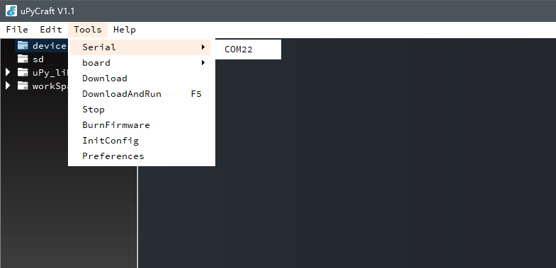

# 通过Python进行Nodemcu的编写

使用__[MicroPython](http://www.micropython.org/)__，及相应IDE对Nodemcu进行编辑控制


# 导航

* __[实验说明](#1)__
* __[实验准备](#2)__
* __[环境搭建](#3)__
* __[实施](#4)__
  * __[连通测试](#5)__
  * __[硬件连接](#6)__
  * __[程序创建](#7)__
* __[相关资料](#8)__


# <a name='1'>实验说明</a>

面向实验级的微控制器：Nodemcu。

在避免原本C语言环境及IDE编辑的情况下，同样可以采用Python语言和相关环境，来进行全面的开源开发设计。使用Python环境对其进行开发，可以更大程度的保证控制器开发的便捷性与开发者的适应性。

同时，依赖于Python便捷且丰富的工具包，将进一步提升该类控制器的代码管理及设计空间。


# <a name='1'>实验准备</a>

* __平台：Windows__
* __环境：Python 3.7__
* __IDE：[uPyCraft V1.1](./tool)__
  * `uPyCraft`是一个可运行在Windows平台的MicroPython编程IDE，其界面简洁，操作便利，简单且实用。

* __硬件：NodeMcu__
* __固件：[esp8266-20190529-v1.11.bin](./tool)__


# <a name='2'>环境搭建</a>

1. __[点此链接](http://micropython.org/download#esp32)__，根据控制器的板型进行固件的下载。这次选用的Nodemcu采用的是__`ESP8266`__芯片，所以选择相应的__`固件`__进行下载，并放置于文件夹中；

   

2. Python 3.7的安装：__[点击此处](https://www.python.org/downloads/release/python-370/)__获取下载链接及查看相关资料，下载后可直接根据提示进行安装并进行__`环境变量`__的默认配置，具体操作请查看相关资料；

3. uPyCraft IDE安装，该程序文件存储在__`tool文件夹`__下，或者你也可以通过此链接__[进行下载](https://randomnerdtutorials.com/uPyCraftWindows)__。下载后的文件为可执行文件，在确保Python3.7环境正常的情况下，便可直接打开进行下一步操作；

   

4. 连接设备：将控制器通过数据线连接至PC端口，通过右击__“电脑”——“管理”——“设备管理器”——“端口”__，查看串口号。

   

   再打开下载的IDE，选择菜单栏的“工具”——“串口”，便可看到已识别且连接的设备：

   

   __说明:__如果设备插入PC中，IDE却无法检测并识别，请检查：__1.USB线缆是否存在异常2. USB驱动程序是否异常__

5. 烧写固件：点击对应的端口后，出现固件烧写界面，板型我们选择“ESP8266”，固件选择单机__“Users”—— “choose”__，并选定之前下载的固件：

   

   点击“OK”，开始进行烧录，并观察进度直至完成烧写：

   

6. 检查连接：烧写完成后，再次点击__“Tools”——“Serial”__，便可以观察到IDE页面的相关变化，__文件管理栏__出现了设备的根配置程序，__状态栏__显示了设备的打开状况，以及__操作栏__的连接状态显示，表示环境已搭建完成

   


# 实施

## <a name='5'>连通测试</a>

在环境搭建完成的情况下，可以通过IDE内部现有的案例程序，进行连接状况的测试，并进行程序的烧写测试：

1. 打开IDE，选择控制器串口后，进行如下选择，便可以打开相应的__测试程序__：

   

2. 随后，我们便可看到IDE编辑栏中的主代码程序，完完全全的Python可编辑程序，只需导入相应的工具并__进行GPIO后的输入输出的操作，即可实现控制__，或进行功能性开发与拓展。

   

3. 在连接正常的的情况下，点击操作栏中开始按钮（三角形图标），程序便开始向开发板中烧入了，状态栏同样会进行相关状态的显示：

   

4. 烧入成功后，便可以观察到开发板的指示灯，开始按python程序中的设定进行闪烁。


## <a name='6'>硬件连接</a>

进行硬件的简单连接，其中__`SPI`__引脚都采用了SPI工具的引用，进行了软定义，使得OLED一如既往的更加贴合于Nodemcu控制器:

| NodeMcu      | 0.96"OLED（SPI） | Soil  Sensor |
| ------------ | ---------------- | ------------ |
| D0（GPIO16） | CS               |              |
| D1（GPIO5）  | DC               |              |
| D2（GPIO4）  | RES              |              |
| D3（GPIO0）  | D1               |              |
| D4（GPIO2）  | D0               |              |
| GND          | GND              | GND          |
| 3.3V         | VCC              | VCC          |
| A0（ADC）    |                  | A            |


## <a name='7'>程序创建</a>

在环境部署、连接测试都完成且正常的情况下，我们便可以进行自己的程序开发和系统搭建了：

1. 文件管理器的程序是可以进行命名、删除等操作的，当设备连接后，对应设备的程序便会在__`“device”`__目录中显示，而__`boot.py`__程序将会作为基本的配置程序而永远存在，请__不要随意删除，或是做好相应的备份__：

   

2. 点击操作栏中的__`“stop“`__按钮，停止设备后，关闭案例程序，并进行删除后，点__”File“——”New“__，或者直接点击操作栏的第一个按钮，进行程序文件的创建，点击__”保存“__按钮，对其进行命名操作（注意要以.py为后缀）：

   

3. 接着，打开__`src文件`__下编写好的程序，拷贝至IDE编辑栏中显示的该文件下，并进行相应配置的更改，代码及相应说明具体如下：

   ```python
   from machine import SPI
   from machine import Pin
   from machine import ADC
   from ssd1306 import SSD1306_SPI
   from simple import MQTTClient
   import network
   import time
   import json
   
   # WiFi配置
   Wifissid = 'yuhan888888'
   Wifipasswd = 'yuhan123456'
   # MQTT配置：地址、TOKEN、主题
   SERVER = "47.103.121.23"
   CLIENT_ID = "L9ZPRGlt6Bl7P8FXYRRd"
   TOPIC = "v1/devices/me/telemetry"
   username='L9ZPRGlt6Bl7P8FXYRRd'
   passwd=''
   
   # 采用默认的SPI引脚时：
   # spi = SPI(1)
   # 采用自定义SPI引脚时：		(OLED)D0-CLK/sck    (OLED)D1-MOSI
   spi = SPI(baudrate=10000000, polarity=1, phase=0, sck=Pin(2,Pin.OUT), mosi=Pin(0,Pin.OUT), miso=Pin(12))
   display = SSD1306_SPI(128, 64, spi, Pin(5), Pin(4), Pin(16));
   
   
   # WiFi连接函数
   def wifi_connect(essid, password):
       if essid == None or essid == '':
           raise BaseException('essid can not be null')
       if password == None or password == '':
           raise BaseException('password can not be null')
       sta_if = network.WLAN(network.STA_IF)
       if not sta_if.active():
           #print("set sta active")
           sta_if.active(True)
       if not sta_if.isconnected():
           #print('connecting to network...')
           sta_if.connect(essid, password)
           retry_times = 30
           time.sleep(2)
           while not sta_if.isconnected() and retry_times > 0:
               # print(" wait a moment i will try %s items,please" % retry_times)
               time.sleep(2)
               retry_times -= 1
       print('network config:', sta_if.ifconfig())
   
   
   # 土壤湿度校准与读取
   def soilhum_read():
       adc0=ADC(0)  
       # 数据实时采集:需要进行百分比映射,用以下函数读取干湿情况下的极值
       # valueCheck = ad0.read()
       # 如：“最湿润”时读取的模拟值为：minval = 375;
       #    “最干燥”时读取的模拟值为：maxval = 785;
       maxval = 840
       minval = 375
       soilValue = round(((1024 - adc0.read())- (1024-maxval))/(maxval-minval) * 100,1)
       print(soilValue)
       return(soilValue)
   
   
   # MQTT发布函数
   def msg_Pub():
       global c  
       server=SERVER
       c = MQTTClient(CLIENT_ID, server,1883,username,passwd)
       c.connect()
       while True:
         SoilHum = soilhum_read()
         paylod_ = {'SoilHum' : SoilHum }
         msg_ = json.dumps(paylod_)
         c.publish(TOPIC,msg_,retain= True)
         oledisplay(SoilHum)
         time.sleep(2)
         
   # OLED显示函数
   def oledisplay(SoilHum):
       try:
         # 清屏
         display.fill(0)
         display.invert(0)
         
         display.rect(0,0,128,64,1)
         display.rect(1,1,126,62,1)
         display.hline(1,24,128,1)
         display.hline(15,22,95,1)
         #display.hline(20,18,85,1)
         display.fill_rect(4,27,120,5,1)
   
         display.text('  SOIL - HUM',4,6)
         display.text('Soilhum :',5,40)
         display.text(str(SoilHum),86,40)
         # 显示内容
         display.show()
         
       except Exception as ex:
         print('Unexpected error: {0}'.format(ex))
         # 关闭显示
         display.poweroff() 
   
   
   # WiFi断开函数
   def disconnect():
       sta_if = network.WLAN(network.STA_IF)
       if sta_if.isconnected():
           sta_if.disconnect()
           # print('the network had been disconnect')
   
   # 主函数
   if __name__ == "__main__":
       display.poweron()
       display.init_display()
      
       wifi_connect(Wifissid, Wifipasswd)
       msg_Pub()
   ```

4. 导入相应的工具和库：如进行显示显示和MQTT发送的库文件，为IDE自带程序。与传统的MQTT发送工具不同，该类工具__主要面向于ESP物联网开发平台而进行封装设计__，其它所需的第三方库文件则需单独进行python的下载操作。而此次程序中所应用的工具多为IDE自带，所以只需__通过“拖拽”拷贝至”device“目录下__即可：

   

5. 一切准备就绪后，再次点击开始按钮，进行烧写。烧写完成后，便__可以实现模拟数据的采集，并进行OLED数据显示，同时进行WiFi网络的连接及MQTT下的数据发送__了：

   


# <a name='8'>相关资料</a>

<https://dfrobot.gitbooks.io/upycraft_cn/content/>